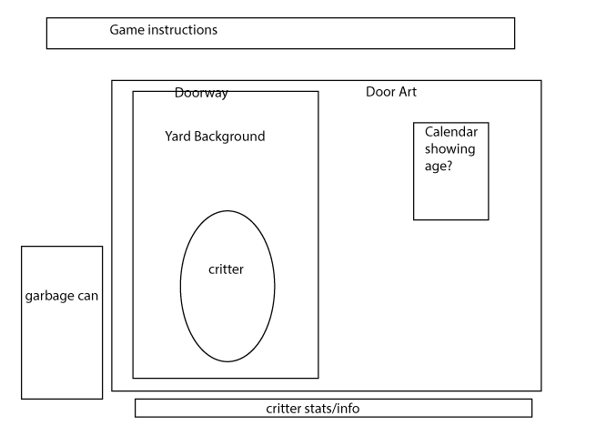

# READ ME

## HEADLINE
"MY Friend Roscoe" is a simple 'Tomagotchi' type online game based on the user's relationship with a digital urban raccoon.

## WIRE FRAME

## User Stories
- Upon loading, users will be presented with a scene looking out the back door of a house in an urban area.  The door will be closed.
- A small animal (perhaps a raccoon) will be visible through the door.
- User will be presented with instructions about how to interact with this animal
- upon opening the door, the user will be  presented with several relevant statistics denoting the animal's status, specifically its 'hunger level', its 'tiredness rating' and it's 'boredness quotient'.  Actual terms TBD.
- these statistics should go down over time, and if they reach zero, the animal will die and the game will be over.
- a fourth statistic will be kept to denote the number of 'days' the user has been interacting with the animal.
- after some predetermined number of 'days', the animal will move on and the game will be over.
- the user will be presented with specific options that can improve the animals respective statisctics.  i.e. feed the animal and it will be less hungry.
- the animal itself will animate depending on its statistics and the users decisions.
- the game will visually denote the passage of time via a day/night animation.
- the game will present itself fashionably on both desktop and mobile devices.
